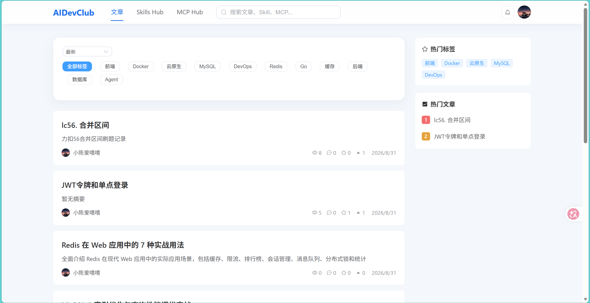
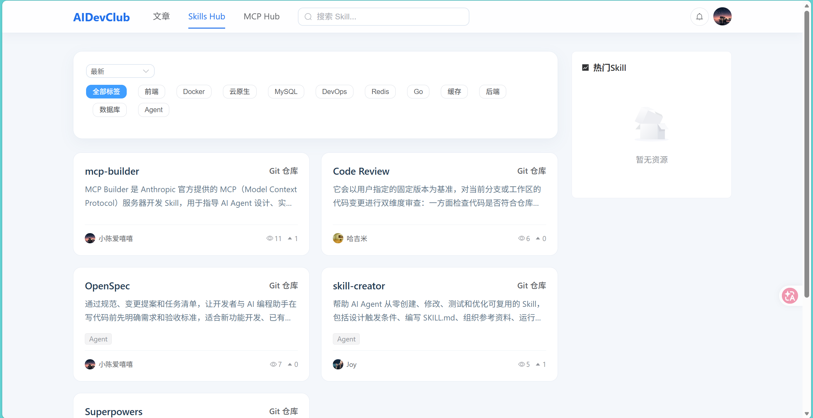
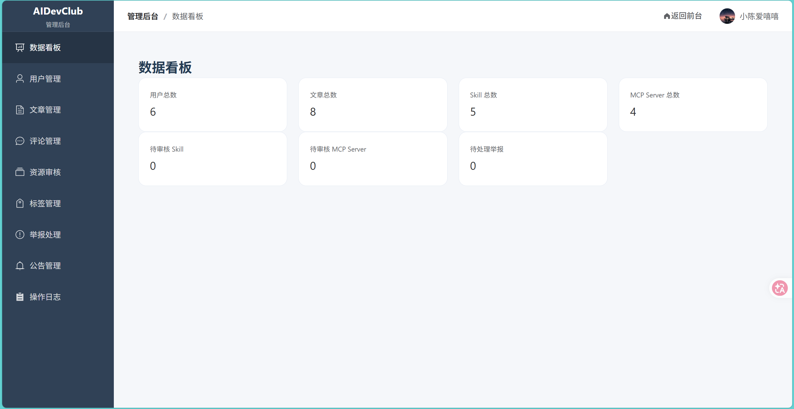

# AIDevClub

面向开发者和 AI Agent 的技术内容与 AI 资源社区。AIDevClub 提供文章、Skill 和 MCP Server 的发布、发现、互动与审核能力，并通过 MCP 接口把平台内容开放给 AI 客户端。

## 项目概览

- **技术社区**：发布和阅读技术文章，支持评论、点赞、收藏和举报。
- **Skills Hub**：发布、审核和发现 AI Agent Skill。
- **MCP Hub**：发布、审核和发现 MCP Server，并展示安装配置。
- **统一搜索与排行**：支持文章、Skill、MCP Server 的全文搜索和热门排行。
- **通知与管理后台**：处理评论、互动、公告、举报、资源审核和操作日志。
- **平台 MCP Server**：让 Claude Code、Cursor、Windsurf 等 MCP 客户端检索 AIDevClub 内容。

## 页面预览

### 文章与网站首页

### Skills Hub

### 后台管理

## 技术栈

| 层级 | 技术 |
| --- | --- |
| 后端 | Go 1.25、Gin、GORM |
| 前端 | Vue 3、TypeScript、Vite、Element Plus、Pinia |
| 数据库 | MySQL 8（中文全文检索使用 ngram parser） |
| 缓存 | Redis 7 |
| 异步通知 | RabbitMQ 4（管理界面）+ MySQL Transactional Outbox |
| 接口 | REST API、Streamable HTTP MCP |
| 部署 | Docker Compose、Nginx |

## 目录结构

~~~text
cmd/
├── server/       # REST API 与平台 MCP Server 的组合入口
└── mcp-server/   # 独立 MCP Server 入口

internal/
├── handler/      # REST API Handler
├── service/      # 业务逻辑
├── repo/         # 数据访问
├── model/        # 数据模型
├── platform/     # 配置、数据库、Redis、鉴权、中间件
└── mcpserver/    # MCP 协议与工具实现

frontend/         # Vue 前端
deploy/           # Docker、Nginx 与生产部署脚本
docs/             # MCP 指南、设计文档与测试报告
~~~

## 快速开始

### 环境要求

- Go 1.25+
- Node.js 18+
- Docker 与 Docker Compose

### 1. 启动基础设施

~~~bash
docker compose up -d
~~~

默认启动：

- MySQL 8：localhost:3306（数据库名和账号凭据请按本地环境配置）
- Redis 7：localhost:16379
- RabbitMQ AMQP：localhost:5672
- RabbitMQ 管理界面：http://localhost:15672（默认本地账号 `notification` / `notification`）

本地 RabbitMQ 凭据可通过 `RABBITMQ_DEFAULT_USER` 和 `RABBITMQ_DEFAULT_PASS` 覆盖；自定义凭据时，同时设置后端的 `AIDEVCLUB_NOTIFICATION_RABBITMQ_URL`。管理端口仅用于本地开发，生产部署默认绑定到服务器回环地址。

### 2. 启动后端

在项目根目录执行：

~~~bash
# REST API：localhost:8080
go run ./cmd/server
~~~

通知默认使用 Outbox 模式。可通过 `AIDEVCLUB_NOTIFICATION_MODE=sync` 切到同步 best-effort 模式；设置为 `outbox` 时，互动和 Outbox 事件在同一 MySQL 事务提交，独立 worker 再投递到 RabbitMQ。RabbitMQ 暂不可用不会阻断互动请求，未投递事件留在 MySQL，worker 会持续按退避间隔重试。

### 通知压测与失败恢复

在 Windows PowerShell 中运行以下命令，会先启动 MySQL、Redis、RabbitMQ，再启动同一个 Go 服务二进制，分别对点赞、收藏和评论接口执行相同的 k6 并发与时长测试：

~~~powershell
.\scripts\run-notification-benchmark.ps1 -Mode both -VUs 20 -Duration 30s
~~~

脚本使用独立的本地测试用户和文章，通过专用 JWT 令牌访问真实 HTTP 鉴权中间件。每个场景的 k6 原始汇总、机器配置、应用进程 CPU/内存采样和 MySQL/Redis/RabbitMQ 容器资源采样写入 `docs/notification-benchmark-runs/<时间>-<随机标识>/`。测试结束后以 `docs/notification-sync-benchmark.md` 与 `docs/notification-rabbitmq-benchmark.md` 中记录的实测值为准；旧热榜压测数据与本测试无关。

消费者对数据库写入失败采用 1 秒、5 秒、30 秒延迟重试，最多重试 8 次后将消息转入 `aidevclub.notifications.dead` 死信队列。排查时先在 RabbitMQ 管理界面查看死信消息的 `event_id` 和错误头，修复根因后可在 MySQL 重新开放对应 Outbox 事件：

~~~sql
UPDATE notification_outbox_events
SET status = 'pending', retry_count = 0, next_retry_at = NULL,
    locked_until = NULL, lease_token = '', last_error = NULL, published_at = NULL
WHERE event_id = '<event-id>' AND status = 'published';
~~~

Outbox Publisher 会使用原事件 ID 补发，通知表唯一事件索引会阻止重复消费产生重复通知。确认通知已写入后，可从死信队列清理原消息。

如果需要单独运行 MCP Server：

~~~bash
# MCP Server：localhost:8081
go run ./cmd/mcp-server
~~~

cmd/server 已经会同时启动 REST API 和平台 MCP Server；通常本地开发只需要启动它。

### 3. 启动前端

~~~bash
cd frontend
npm install
npm run dev
~~~

前端默认地址为 <http://localhost:5173>，开发代理会把 /api 和 /static 请求转发到 localhost:8080。

## 构建与测试

~~~bash
# 后端格式化与测试
gofmt -w ./cmd ./internal
go test ./...

# 后端构建
go build ./...

# 前端类型检查、Lint 与生产构建
cd frontend
npm run typecheck
npm run lint
npm run build
~~~

需要运行后端集成测试时，请先启动 MySQL 和 Redis。测试代码会使用 internal/testutil 提供的测试数据库辅助能力。

## MCP 使用

本地 MCP 地址：http://localhost:8081/mcp。线上地址：https://aidevclub.xyz/mcp。

平台 MCP Server 使用 Streamable HTTP，公开工具包括：

- search_content：搜索文章、Skill 和 MCP Server
- browse_content：按最新或热门浏览内容
- get_article：读取文章详情，支持长内容分页
- get_skill：读取 Skill 详情
- get_mcp_server：读取 MCP Server 详情
- list_taxonomy：查询分类和标签

携带 Bearer Token 后，还可以使用 get_my_profile、list_my_content 和 list_my_notifications。

以 Claude Code、Cursor 等客户端为例，MCP 配置形如：

~~~json
{
  "mcpServers": {
    "aidevclub": {
      "url": "https://aidevclub.xyz/mcp"
    }
  }
}
~~~

完整工具参数、认证方式、错误处理和分页示例见 [docs/mcp-server-guide.md](docs/mcp-server-guide.md)。

## 健康检查

~~~bash
curl http://localhost:8080/healthz
curl http://localhost:8080/readyz
~~~

/healthz 用于存活检查，/readyz 用于检查 MySQL 和 Redis 是否就绪。

## 部署

生产部署相关文件位于 [deploy/](deploy/)：

- docker-compose.prod.yml：生产服务编排
- Dockerfile.backend：后端镜像
- Dockerfile.frontend：前端镜像
- nginx.conf：生产 Nginx 配置
- deploy.sh、setup-server.sh：部署辅助脚本

部署前请准备生产环境变量，并通过 CI/CD Secret 注入 SSH 私钥、数据库密码、JWT 密钥和管理员邮箱。仓库不应保存任何真实私钥或生产凭据。

## 相关文档

- [docs/mcp-server-guide.md](docs/mcp-server-guide.md)：MCP Server 使用指南
- [docs/roadmap.md](docs/roadmap.md)：项目路线图
- [docs/](docs/)：设计文档、阶段总结和测试报告
- [线上站点](https://aidevclub.xyz)
- [GitHub 仓库](https://github.com/taogoing/AiDevClub)

## 贡献

欢迎通过 Issue 或 Pull Request 提交问题、改进建议和代码。提交前请至少运行与改动相关的后端测试或前端检查，并避免将构建产物、日志、.env 文件和密钥加入版本库。

## 许可证

当前项目主要用于学习和研究。正式对外发布前，请补充明确的开源许可证文件与版权说明。
